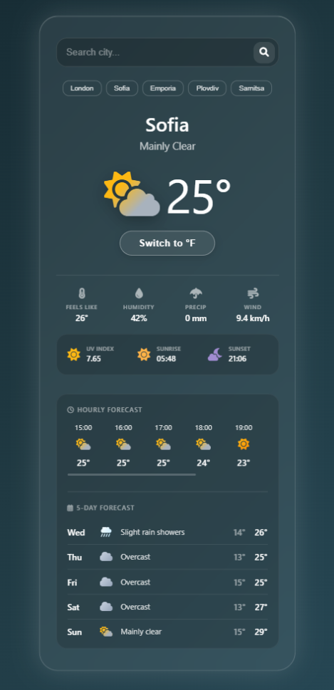

# ⛅ Premium Weather App

A modern, high-performance web application that delivers real-time weather forecasting with a stunning, dynamic user interface. Designed with absolute attention to detail, the app features a "Living Interface" that reacts visually to current weather conditions, providing an immersive user experience.

## 📸 Preview

*(Note: Replace this image with an actual screenshot of the app)*

## ✨ Key Features

* **Real-Time Global Search:** Instant weather data retrieval for any city worldwide.
* **Automatic Geolocation:** Prompts the user for location access to display local weather immediately upon loading.
* **The "Living Interface":** * Dynamic background FX (falling rain, snow, or twinkling stars) based on live weather codes.
    * A breathing UI container that adjusts its animation speed depending on the actual wind speed.
    * Adaptive aura glow that changes color to match the atmosphere.
* **Advanced Metrics Dashboard:** Precise data including Feels Like temperature, Humidity, Precipitation, and Wind Speed.
* **Solar & UV Tracking:** Dedicated module displaying Sunrise, Sunset, and maximum UV Index.
* **Comprehensive Forecasting:** * 8-Hour horizontal scrolling forecast.
    * 5-Day vertical forecast with visual minimum/maximum temperature ranges.
* **Seamless Unit Toggling:** Instantly switch between Celsius (°C) and Fahrenheit (°F) across the entire application without additional API calls.
* **Smart Search History:** Saves the last 5 searched locations using `localStorage` for quick access.

## 🛠️ Technologies & Architecture

Built with a focus on clean code and modularity, strictly utilizing Vanilla web technologies without heavy frameworks.

* **Frontend:** HTML5, Custom CSS3 (Glassmorphism design, CSS Variables, Keyframe Animations), Vanilla JavaScript (ES6+).
* **Architecture:** ES6 Modules separation (`api.js`, `ui.js`, `weather-codes.js`, `app.js`) for maintainability and clean concern isolation.
* **Data APIs:** * [Open-Meteo API](https://open-meteo.com/) (Weather data & Geocoding, highly accurate, no API key required).
    * [Nominatim API](https://nominatim.org/) (Reverse geocoding for accurate location naming).
* **Optimization:** Implemented an in-memory caching system (10-minute TTL) to drastically reduce redundant API calls and improve performance.
* **Icons:** FontAwesome 6.

## 🚀 How to Run Locally

Since this project uses ES6 Modules (`<script type="module">`), it needs to be served via a local web server to avoid CORS policy restrictions in the browser.

1. **Clone the repository** or download the files.
2. **Open the project folder** in your preferred code editor (e.g., VS Code).
3. **Start a local server:**
   * *Option A:* If using VS Code, install the **Live Server** extension, right-click `index.html`, and select "Open with Live Server".
   * *Option B:* If using Python, run `python -m http.server` in the terminal.
   * *Option C:* If using Node.js, run `npx serve`.
4. **View the app** in your browser at `http://localhost:5500` (or your respective local port).

---
*Developed by Kristian Petrov.*